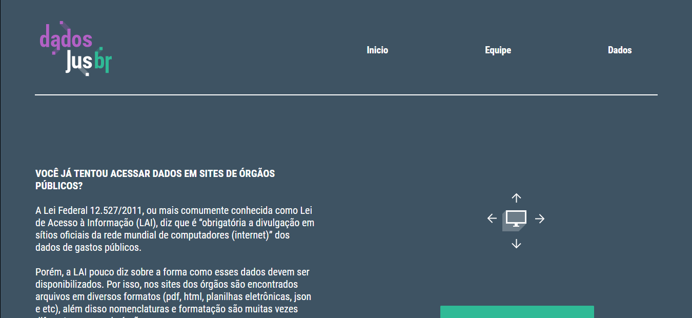

# Site dadosjusbr.org

Site do projeto DadosJusBR

> Ao mudar o foco para o sistema de justiça (incluindo MPs, Procuradorias e Defensorias) tivemos que mudar o formato de dados, coletores e o site. Estamos trabalhando árduamente para chegar na versão 1.0, o que deve acontecer no primeiro semestre de 2020.

[](https://gitpod.io/#https://github.com/dadosjusbr/site-novo)

A Lei de Acesso à Informação [(Lei n. 12.527, de 2011)](http://www.planalto.gov.br/ccivil_03/_ato2011-2014/2011/lei/l12527.htm), regula a obrigatoriedade da disponibilização na internet dos dados de gastos público, porém esses dados não são padronizados e cada órgão tem sua própria formatação, podendo ser encontrado em diversas nomenclaturas e tipos diferentes de arquivos (pdf, html, planilhas eletrônicas, json e etc). Por esse motivo, esses arquivos não possuem um formato amigável para ser usado por ferramentas de análise e processamento de dados.

Pensando nisso, o projeto [dadosjusbr](https://github.com/dadosjusbr) tem como principal objetivo prover acesso às informações de remunerações do sistema judiciário de forma consolidada e em formato aberto. Para tal, utilizamos do framework Nextjs para criar as interfaces do usuários e alimentamos essas interfaces com um servidor ambientado em GoLang.

Com essas tecnologias como base, criamos sistemas computacionais que realizam a coleta, conversão, consolidação e validação dos dados de forma contínua. O DadosJusBr é conectado ao repositório de [coleta](https://github.com/dadosjusbr/coletores), que é responsável por adquirir os dados dos órgãos e padronizá-los. Já o repositório de [storage](https://github.com/dadosjusbr/storage), é responsável pelo armazenamento desses dados coletados.

Com o monitoramento contínuo, podemos cobrar a disponiblização ou correção de informações, caso necessário. Por fim, disponibilizamos o [DadosJusBr](https://dadosjusbr.org/), um portal onde os dados são publicados em um formato amplamente compatível com ferramentas de análise e processamento de dados e estão organizados em uma página por mês de referência. Mais informações [aqui.](https://dadosjusbr.org/#/sobre)

Esse projeto foi elaborado com o intuito de praticar a cidadania e tornar os dados mais acessíveis para o cidadão. Você cidadão/empresa pode fazer parte dessa jornada conosco, quer saber como?

- Informe se há alguma inconsistência ou erros no site.
- Atue como fiscal e cobre dos órgãos sobre a disponibilidade dos dados à população.
- Sugira novos órgãos para elaboração de robôs, se tiver conhecimento, desenvolva um.
- Sugerir coisas interessantes que você acha que irão contribuir para o projeto!

## O Dados Jus




## Tecnologia

Essa aplicação foi feita utilizando o next js [Next.js](https://nextjs.org/) o arquebouço [`create-next-app`](https://github.com/vercel/next.js/tree/canary/packages/create-next-app).

### Dependencias

- [`styled-components`](https://styled-components.com/)
- [`eslint`](https://eslint.org/)

Este projeto utiliza o `npm` para gerenciamento de dependências. Para evitar problemas com versões de produção e desenvolvimento, não utilize o `yarn`.

## Rodando localmente com Docker

Antes de mais nada, é necessário ter o [Docker](https://www.docker.com/get-started/) e o [Docker compose](https://docs.docker.com/compose/install/) instalados na sua máquina.

Crie uma cópia do arquivo `.env.sample` e renomeie para `.env.local` e configure as variáveis devidamente, caso necessário.

É importante configurar as variáveis de ambiente que utilizam o termo "localhost" (caso você queira integração com a API do dadosjusbr). O Docker não consegue ter acesso ao localhost, por isso, é necessário substituir o termo pelo endereço IP da máquina. Para conseguir o endereço IP, execute o seguinte comando:

```console
$ hostname -I | cut -d" " -f1
```

Para rodar o site localmente utilizando o docker, é necessário fazer o build do docker file e depois rodar a imagem docker. Para isso, execute os seguintes comandos no terminal:

```bash
docker build -t site .
docker run -d -p 3000:3000 --env-file .env --rm --name site site
```

Para checar se ocorreu tudo bem:

```bash
docker logs site
```

Caso tenha ocorrido tudo bem, entre no endereço [http://localhost:3000](http://localhost:3000) no seu navegador para ver o resultado.

## Como rodar localmente (sem Docker)

Para conseguir rodar o servidor de desenvolvimento, sem utilização de Docker, é necessário ter o [Node.js](https://nodejs.org/pt-br/) instalado na sua máquina; ele é um runtime de JavaScript, necessário para executar nosso script.

Ao clonar o repositório você deve rodar o seguinte comando para fazer o download das dependências necessárias:
```
npm i --legacy-peer-deps
```

Crie uma cópia do arquivo `.env.sample` e renomeie para `.env` e configure as variáveis devidamente, caso necessário.

Rodando o servidor de desenvolvimento:

```bash
npm run dev
```

Entre no endereço [http://localhost:3000](http://localhost:3000) no seu navegador para ver o resultado.

## Aprenda mais!

Para aprender mais sobre o Next.js veja algumas documentações

- [Documentação do Next.js](https://nextjs.org/docs): aprenda mais sobre as features que o Next.js proporciona.
- [Learn Next.js](https://nextjs.org/learn) - um tuturial interativo de Next.js.

